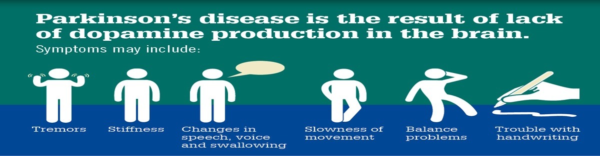

# 🧠 Parkinsights: Parkinson’s Disease Detection

This project uses deep learning and machine learning techniques to detect Parkinson’s disease from image data. It integrates CNN-based feature extractors like VGG16, ResNet50, and EfficientNetB1, combined with PCA for dimensionality reduction and an SVM classifier for final prediction.

---

## 🚀 Demo



Live demo coming soon...

---

## 📌 Table of Contents

- [About the Project](#about-the-project)
- [Tech Stack](#tech-stack)
- [How It Works](#how-it-works)
- [Installation](#installation)
- [Usage](#usage)
- [Results](#results)
- [Project Structure](#project-structure)
- [Contributing](#contributing)
- [License](#license)

---

## 📖 About the Project

Parkinson’s Disease is a progressive neurological disorder that affects movement. Early detection can help manage symptoms and improve quality of life. This project attempts to classify whether a person is affected by Parkinson's or not using image-based input processed through deep learning models and a classical SVM classifier.

---

## 🧰 Tech Stack

- **Python**
- **Flask** – for web app backend
- **HTML/CSS/Bootstrap** – for front-end UI
- **TensorFlow / Keras** – CNN feature extraction
- **scikit-learn** – PCA and SVM
- **Matplotlib / skimage** – image preprocessing
- **Git & GitHub** – version control & collaboration

---

## ⚙️ How It Works

1. User uploads an image.
2. Image is preprocessed (median filter, histogram equalization, resized).
3. Features are extracted using:
   - **VGG16**
   - **ResNet50**
   - **EfficientNetB1**
4. Features are reduced using **PCA**.
5. An **SVM** model predicts the final result (healthy or Parkinson’s).

---

## 🧪 Installation

```bash
git clone https://github.com/basi1l/Parkinsights-parkinson-s-disease-detection.git
cd Parkinsights-parkinson-s-disease-detection
pip install -r requirements.txt
```

Make sure you have TensorFlow, scikit-learn, Flask, and other dependencies installed.

---

## ▶️ Usage

```bash
python app.py
```

- Open your browser and go to `http://127.0.0.1:5000/`
- Upload an image and click "Submit"
- See the prediction result

---

## ✅ Results

The model outputs:
- **Healthy** if no signs of Parkinson’s are detected.
- **Parkinson** if symptoms are likely present.
- **None** if the confidence score is below a set threshold (e.g., 80%).

---

## 📁 Project Structure

```
├── app.py
├── templates/
│   ├── base.html
│   └── home.html
├── static/
│   ├── style.css
│   ├── img3.jpg
│   └── img4.jpg
├── mmodel.pkl
└── README.md
```

---

## 🤝 Contributing

Pull requests are welcome. For major changes, please open an issue first to discuss what you would like to change.

---

## 📄 License

This project is open source and available under the [MIT License](LICENSE).

